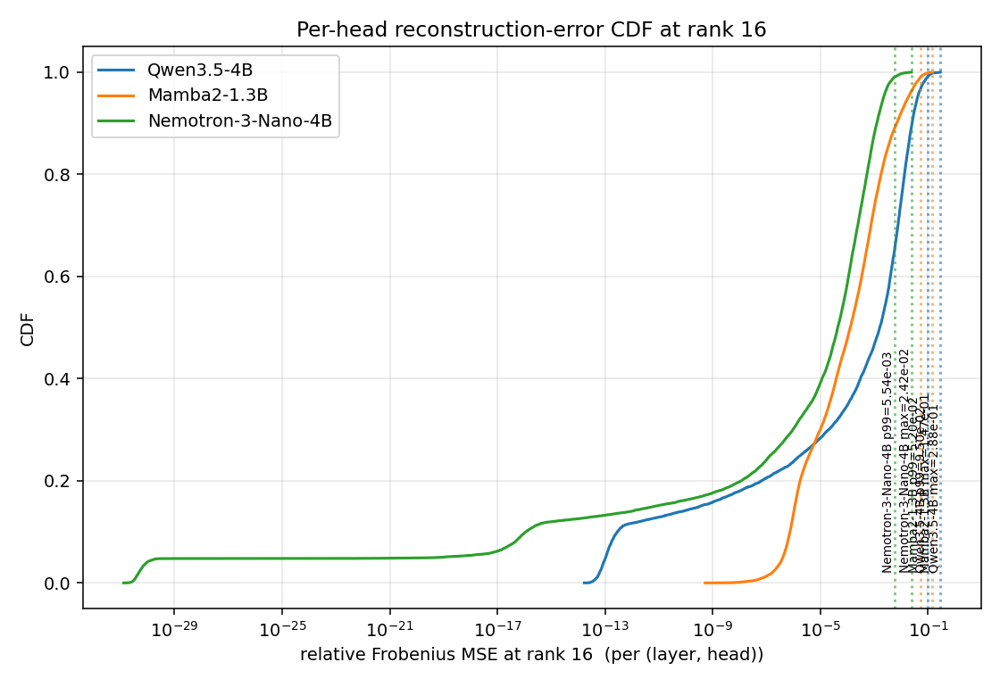
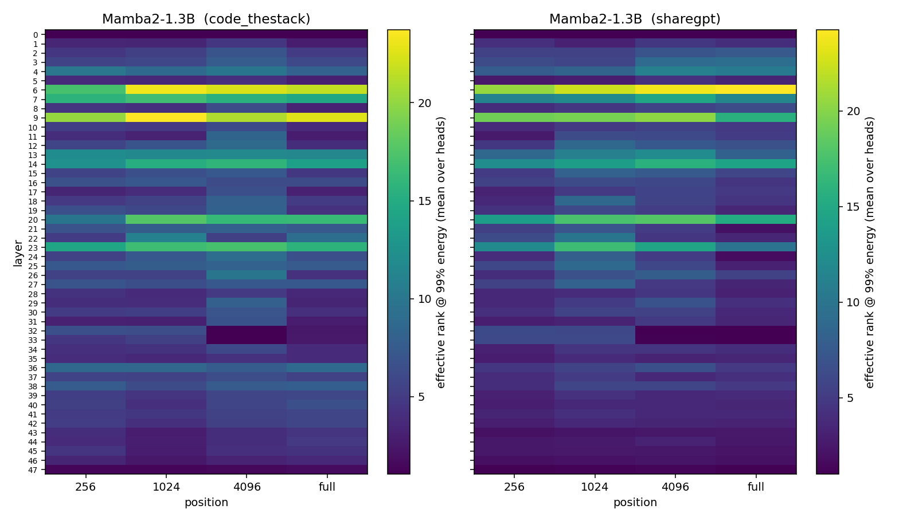
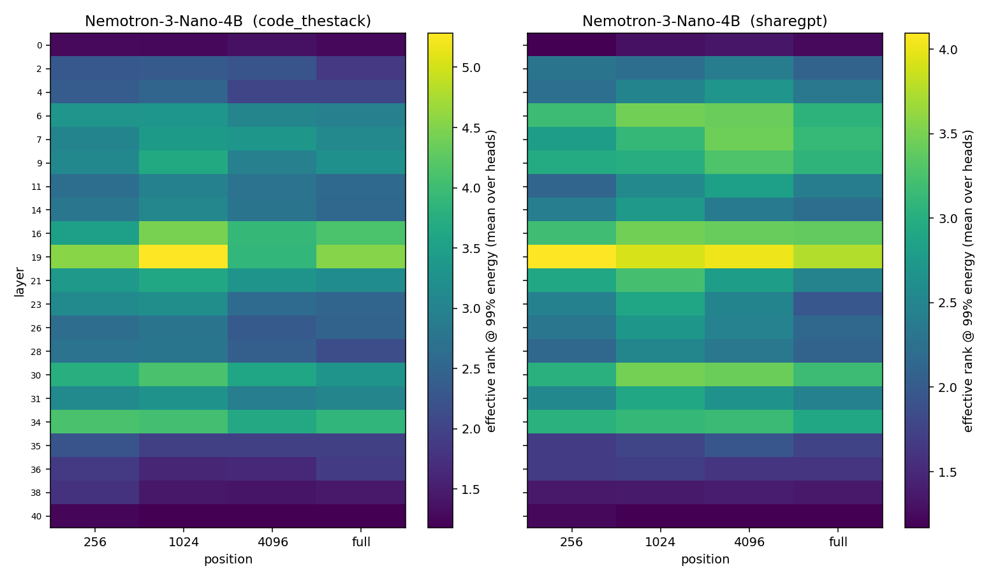
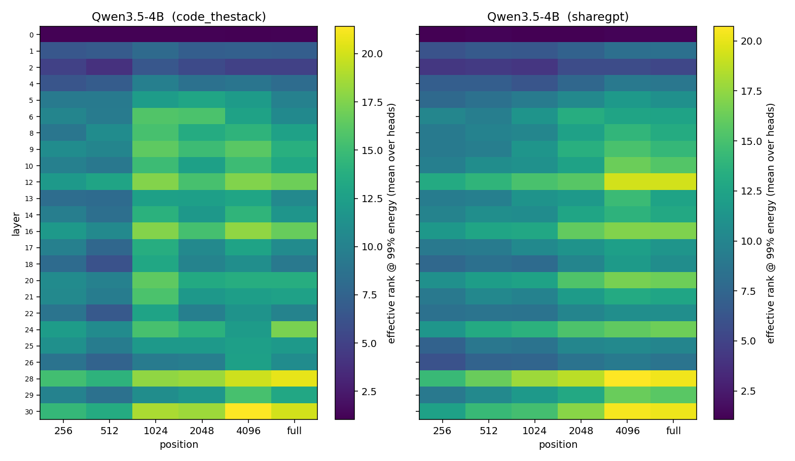
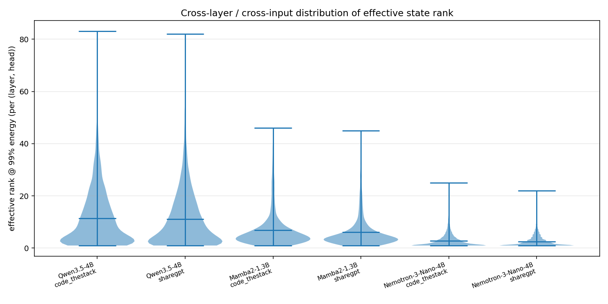
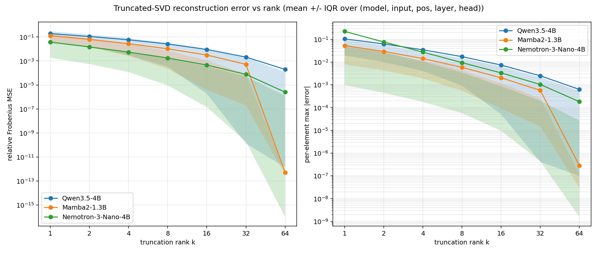
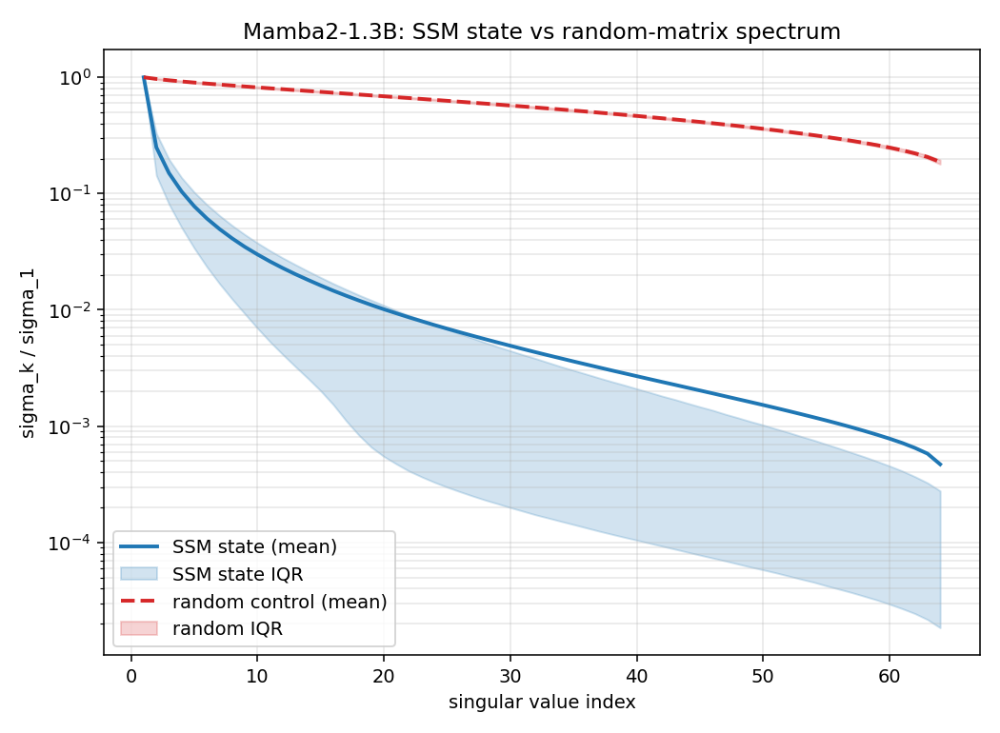
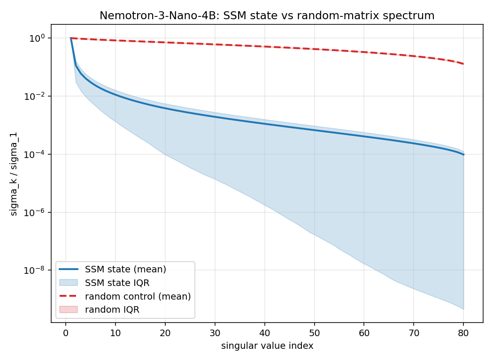
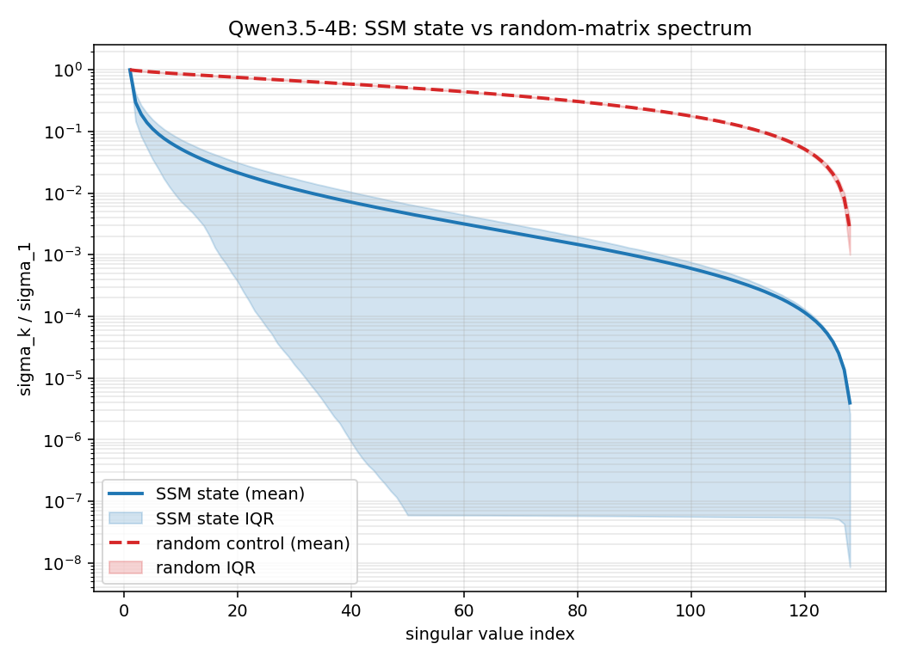

# HiServe Section 1 — State-Level Reconstruction Fidelity

Auto-generated from per-model `metrics.csv` runs. See `svd_sweep/run_qwen35.py`, `run_mamba2.py`, `run_nemotron.py` for the capture pipeline; `plot_results.py` for the figures referenced below.

## TL;DR

- **Qwen3.5-4B** (full grid, GDN hybrid, state `[128,128]`, 1843200 (layer, head, position, input) records): effective rank @ 99% energy is **12.1** on average (median 9); rel-Fro MSE at rank 16 has p99 = **1.06e-01**, max = **3.30e-01**.
- **Mamba2-1.3B** (pure-SSM control, state `[64,128]`, 4915200 records): effective rank @ 99% = **6.5** (median 4); rel-Fro MSE at rank 16 p99 = **5.32e-02**, max = **1.91e-01**.  Confirms concentration is structural to the SSM recurrence, not the hybrid architecture.
- **Nemotron-3-Nano-4B** (Mamba2 hybrid, state `[80,128]`, 3225600 records): effective rank @ 99% = **2.7** (median 2); rel-Fro MSE at rank 16 p99 = **6.20e-03**, max = **4.25e-02**.

## Method

For each `(model, input distribution, sequence position)` we run a single prefill pass, capture the SSM recurrent state at every `(layer, head)`, and compute **one batched SVD per task** on CPU/float64 over a `[N_records, D_k, D_v]` tensor. The `(U, S, Vh)` factors are sliced for every metric in 1.1 (cumulative energy, effective-rank thresholds) and every rank `k` in 1.2 (truncated reconstruction error). For each state we also draw an i.i.d. Gaussian matrix `R` of the same shape and matched element-wise variance and SVD that, as a Marchenko–Pastur baseline. Batched CPU fp64 SVD is ~10x faster than per-matrix calls and ~13x faster than fp64 GPU SVD at these matrix sizes (cuSOLVER's batched fp64 falls back to per-matrix `gesvd`, dominated by launch overhead).

Both SVDs are wrapped in try/except. On failure the spectrum row is marked `spectrum_ok=False` and the reconstruction returns the original `M_hat = M` so that downstream analysis can drop or flag those rows without losing the rest of the record.

**Prompt sampling**: 200 ShareGPT chunks + 200 code chunks per distribution. Each chunk is built greedily by accumulating consecutive source documents until the total reaches `SWEEP_MIN_CHARS_PER_PROMPT` (default 24k chars, ≈5–10k tokens). Sources are `Aeala/ShareGPT_Vicuna_unfiltered` for chat and `codeparrot/codeparrot-clean` for code (public Python from GitHub; `bigcode/the-stack-v2` was the stated preference but it's gated, so the loader falls back automatically). The "full" position is capped at **8,192 tokens for the Mamba2 sweep, 65,536 tokens for Nemotron and Qwen3.5**. The 65,536 cap avoids a `mamba_chunk_scan_combined` Triton illegal-memory-access on very long sequences (one codeparrot file in our corpus tokenizes to 131k tokens). The lower Mamba2 cap was the value in effect when its sweep ran; pure SSM has no `O(seq_len)` KV cache so prefill cost is essentially constant in either case.

**Sweep axes (per `_helpers.py`):**

| model | layers | heads | positions | inputs |
|---|---|---|---|---|
| Qwen3.5-4B (full grid) | 24 linear-attention | 32 V-heads | {256, 512, 1024, 2048, 4096, full} | ShareGPT, Python from GitHub (Stack-v2 fallback) |
| Mamba2-1.3B (subset)   | all 48 | all 64    | {256, 1024, 4096, full} | ShareGPT, Python from GitHub |
| Nemotron-3-Nano-4B (subset) | all `M`-pattern Mamba layers | all 96 | {256, 1024, 4096, full} | ShareGPT, Python from GitHub |

_Note: `bigcode/the-stack-v2` is a gated dataset; the pipeline auto-falls back to `codeparrot/codeparrot-clean` (public, deduplicated Python from GitHub) for the code distribution._

**Parallelism**: capture is dispatched as one task per `(prompt × position)` to a `ThreadPoolExecutor` (`SVD_PARALLEL_WORKERS=4` by default). Forward passes serialize on the GPU via a lock; CPU SVDs run truly in parallel because PyTorch BLAS releases the GIL. With batched per-task SVD plus 4 workers, end-to-end wall time on this Grace Blackwell box is ≈1.5 h for Mamba2 (1600 tasks), ≈1 h for Nemotron (1600), and ≈30 min for Qwen3.5 (2400).

**Implementations**: Mamba2 and Qwen3.5 use the standard transformers built-in models (`mamba2`, `qwen3_5_gated_deltanet`). Nemotron uses transformers' built-in `nemotron_h` (added in 5.7); we deliberately avoid `unsloth/NVIDIA-Nemotron-3-Nano-4B`'s remote-code path because it has two unfixed upstream bugs in `HybridMambaAttentionDynamicCache` (`conv_kernel_size` not set in `__init__`; `update_*_state` reads `.device` off the layer-list rather than the per-layer tensor) and one in `NemotronHSdpaAttention.forward` (`view(bsz, q_len, self.hidden_size)` should be `view(bsz, q_len, self.num_heads * self.head_dim)`, since `num_heads × head_dim ≠ hidden_size` for this checkpoint). The transformers built-in is bug-free and supports SDPA. Nemotron is loaded with `attn_implementation="sdpa"` so attention dispatches to `F.scaled_dot_product_attention` (PyTorch's flash kernels) rather than materialising a full `[seq, seq]` attention-scores matrix; the eager path would OOM on long-context prefills (~450 GB for a 96k forward).

## Results

### Qwen3.5-4B

Records: **1843200**  
Inputs: `['code_thestack', 'sharegpt']`  
Positions: `['full', 256, 512, 1024, 2048, 4096]`  
Layers swept: 24 (0..30)  
Heads/layer: 32  
State shape: `[128, 128]`  (max rank = 128)  

**1.1 Cumulative energy (mean over (input, pos, layer, head))**

| k | state | random control | effective rank @ k of state |
|---|---|---|---|
| 1 | 0.7969 | 0.0302 | — |
| 2 | 0.8798 | 0.0589 | — |
| 4 | 0.9359 | 0.1129 | — |
| 8 | 0.9710 | 0.2109 | — |
| 16 | 0.9897 | 0.3771 | — |
| 32 | 0.9975 | 0.6242 | — |
| 64 | 0.9998 | 0.8945 | — |

**Effective rank thresholds (number of components needed)**

State (Qwen3.5-4B; max possible rank = 128):

| threshold | median | mean | p90 | p95 | p99 | max |
|---|---|---|---|---|---|---|
| 99% | 9 | 12.12 | 28 | 34 | 48 | 85 |
| 99.5% | 12 | 15.96 | 36 | 44 | 58 | 93 |
| 99.9% | 21 | 26.15 | 58 | 66 | 78 | 107 |

Random control (matched-shape iid Gaussian; max possible = 128):

| threshold | median | mean | p90 | p95 | p99 | max |
|---|---|---|---|---|---|---|
| 99% | 99 | 98.94 | 99 | 100 | 100 | 101 |
| 99.5% | 105 | 104.97 | 106 | 106 | 106 | 107 |
| 99.9% | 115 | 114.64 | 115 | 115 | 116 | 117 |

**1.2 Reconstruction error (per (layer, head) records, all (input, pos))**

| rank k | rel-Fro MSE p50 | p90 | p95 | p99 | max | mean | mean cos sim | mean max-abs |
|---|---|---|---|---|---|---|---|---|
| 4 | 3.299e-02 | 1.778e-01 | 2.371e-01 | 3.747e-01 | 6.827e-01 | 6.409e-02 | 0.9663 | 3.906e-02 |
| 8 | 1.082e-02 | 8.190e-02 | 1.179e-01 | 2.269e-01 | 5.062e-01 | 2.905e-02 | 0.9851 | 1.947e-02 |
| 16 | 2.136e-03 | 2.868e-02 | 4.538e-02 | 1.060e-01 | 3.296e-01 | 1.033e-02 | 0.9948 | 8.277e-03 |
| 32 | 1.844e-04 | 6.653e-03 | 1.139e-02 | 3.022e-02 | 1.603e-01 | 2.469e-03 | 0.9988 | 2.870e-03 |
| 64 | 3.986e-06 | 6.096e-04 | 1.101e-03 | 3.010e-03 | 3.565e-02 | 2.343e-04 | 0.9999 | 7.320e-04 |

**SVD robustness**: spectrum SVD ok in 1843200/1843200 (100.0%); all-k reconstruction ok in 1843200/1843200 (100.0%).

### Mamba2-1.3B

Records: **4915200**  
Inputs: `['code_thestack', 'sharegpt']`  
Positions: `['full', 256, 1024, 4096]`  
Layers swept: 48 (0..47)  
Heads/layer: 64  
State shape: `[64, 128]`  (max rank = 64)  

**1.1 Cumulative energy (mean over (input, pos, layer, head))**

| k | state | random control | effective rank @ k of state |
|---|---|---|---|
| 1 | 0.8732 | 0.0436 | — |
| 2 | 0.9373 | 0.0844 | — |
| 4 | 0.9728 | 0.1601 | — |
| 8 | 0.9897 | 0.2936 | — |
| 16 | 0.9969 | 0.5081 | — |
| 32 | 0.9995 | 0.7912 | — |
| 64 | 1.0000 | 1.0000 | — |

**Effective rank thresholds (number of components needed)**

State (Mamba2-1.3B; max possible rank = 64):

| threshold | median | mean | p90 | p95 | p99 | max |
|---|---|---|---|---|---|---|
| 99% | 4 | 6.45 | 14 | 22 | 33 | 48 |
| 99.5% | 6 | 8.42 | 19 | 28 | 40 | 53 |
| 99.9% | 10 | 13.75 | 31 | 42 | 52 | 60 |

Random control (matched-shape iid Gaussian; max possible = 64):

| threshold | median | mean | p90 | p95 | p99 | max |
|---|---|---|---|---|---|---|
| 99% | 60 | 59.84 | 60 | 60 | 60 | 61 |
| 99.5% | 62 | 61.90 | 62 | 62 | 62 | 63 |
| 99.9% | 64 | 64.00 | 64 | 64 | 64 | 64 |

**1.2 Reconstruction error (per (layer, head) records, all (input, pos))**

| rank k | rel-Fro MSE p50 | p90 | p95 | p99 | max | mean | mean cos sim | mean max-abs |
|---|---|---|---|---|---|---|---|---|
| 4 | 9.570e-03 | 6.972e-02 | 1.251e-01 | 2.561e-01 | 5.981e-01 | 2.716e-02 | 0.9860 | 1.430e-02 |
| 8 | 1.676e-03 | 2.565e-02 | 5.647e-02 | 1.361e-01 | 3.962e-01 | 1.032e-02 | 0.9947 | 5.846e-03 |
| 16 | 1.237e-04 | 6.726e-03 | 1.827e-02 | 5.316e-02 | 1.908e-01 | 3.123e-03 | 0.9984 | 2.045e-03 |
| 32 | 2.226e-06 | 8.393e-04 | 2.945e-03 | 1.057e-02 | 5.416e-02 | 5.187e-04 | 0.9997 | 5.731e-04 |
| 64 | 5.825e-30 | 5.387e-29 | 7.534e-29 | 1.025e-28 | 1.387e-28 | 1.707e-29 | 1.0000 | 1.299e-15 |

**SVD robustness**: spectrum SVD ok in 4915200/4915200 (100.0%); all-k reconstruction ok in 4915200/4915200 (100.0%).

### Nemotron-3-Nano-4B

Records: **3225600**  
Inputs: `['code_thestack', 'sharegpt']`  
Positions: `['full', 256, 1024, 4096]`  
Layers swept: 21 (0..40)  
Heads/layer: 96  
State shape: `[80, 128]`  (max rank = 80)  

**1.1 Cumulative energy (mean over (input, pos, layer, head))**

| k | state | random control | effective rank @ k of state |
|---|---|---|---|
| 1 | 0.9612 | 0.0385 | — |
| 2 | 0.9847 | 0.0747 | — |
| 4 | 0.9943 | 0.1422 | — |
| 8 | 0.9981 | 0.2624 | — |
| 16 | 0.9995 | 0.4595 | — |
| 32 | 0.9999 | 0.7314 | — |
| 64 | 1.0000 | 0.9708 | — |

**Effective rank thresholds (number of components needed)**

State (Nemotron-3-Nano-4B; max possible rank = 80):

| threshold | median | mean | p90 | p95 | p99 | max |
|---|---|---|---|---|---|---|
| 99% | 2 | 2.71 | 6 | 8 | 13 | 32 |
| 99.5% | 2 | 3.78 | 9 | 11 | 18 | 41 |
| 99.9% | 5 | 7.82 | 19 | 23 | 33 | 58 |

Random control (matched-shape iid Gaussian; max possible = 80):

| threshold | median | mean | p90 | p95 | p99 | max |
|---|---|---|---|---|---|---|
| 99% | 72 | 72.13 | 73 | 73 | 73 | 74 |
| 99.5% | 75 | 75.25 | 76 | 76 | 76 | 77 |
| 99.9% | 79 | 79.00 | 79 | 79 | 79 | 80 |

**1.2 Reconstruction error (per (layer, head) records, all (input, pos))**

| rank k | rel-Fro MSE p50 | p90 | p95 | p99 | max | mean | mean cos sim | mean max-abs |
|---|---|---|---|---|---|---|---|---|
| 4 | 1.439e-03 | 1.562e-02 | 2.480e-02 | 5.897e-02 | 2.220e-01 | 5.713e-03 | 0.9971 | 2.791e-02 |
| 8 | 3.501e-04 | 5.002e-03 | 8.405e-03 | 2.186e-02 | 1.075e-01 | 1.874e-03 | 0.9991 | 9.940e-03 |
| 16 | 5.599e-05 | 1.308e-03 | 2.310e-03 | 6.198e-03 | 4.246e-02 | 4.971e-04 | 0.9998 | 3.490e-03 |
| 32 | 4.716e-06 | 2.137e-04 | 3.926e-04 | 1.062e-03 | 9.824e-03 | 8.345e-05 | 1.0000 | 1.106e-03 |
| 64 | 6.854e-08 | 6.745e-06 | 1.302e-05 | 3.725e-05 | 4.567e-04 | 2.825e-06 | 1.0000 | 1.982e-04 |

**SVD robustness**: spectrum SVD ok in 3225600/3225600 (100.0%); all-k reconstruction ok in 3225600/3225600 (100.0%).

## Plots

### `cdf_at_k16.png`

### `effrank_heatmap_Mamba2-1.3B.png`

### `effrank_heatmap_Nemotron-3-Nano-4B.png`

### `effrank_heatmap_Qwen3.5-4B.png`

### `effrank_violin.png`

### `error_vs_rank.png`

### `spectrum_overlay_Mamba2-1.3B.png`

### `spectrum_overlay_Nemotron-3-Nano-4B.png`

### `spectrum_overlay_Qwen3.5-4B.png`

## Reviewer's notes

- **MSE is a proxy.** Per the experiment plan, state-level reconstruction error is a sanity-check / diagnostic; the fidelity argument rests on the output-distribution experiments in Section 2 (KL between full-state and low-rank-state logits).
- **SSM-vs-random spectrum overlay** (`spectrum_overlay_*.png`) is the clearest piece of evidence for the structural claim: SSM states have a fast-decaying spectrum while same-shape, same-variance random matrices follow the Marchenko–Pastur bulk.
- **Per-head tail** (`cdf_at_k16.png`) shows that even the worst per-head rel-Fro error at rank 16 is small — the hard part of any tail-driven serving argument.
- **Cap inconsistency.** Mamba2 was capped at 8,192 tokens; Nemotron/Qwen3.5 at 65,536. Mamba2's number was conservative and predates the Triton-bug diagnosis; in practice Mamba2's metrics are insensitive to this cap because the SSM state is fixed-size in `seq_len` and the shorter cap mostly trims a single anomalous 96k+ codeparrot prompt. If perfect symmetry is needed, rerunning Mamba2 at the 65,536 cap is straightforward (`SWEEP_N_PROMPTS=200 SWEEP_MAX_FULL_TOKENS=65536 python run_mamba2.py`) and adds <2 hours.
- **fp64 SVD.** Some Nemotron Mamba states have abs-max ~ 1e-8; fp32 LAPACK SGESDD aborts on those via a Fortran `STOP 1` from `SLASCL` (un-catchable from Python). fp64 LAPACK handles the same matrices cleanly and is essentially free at these tiny matrix sizes.
- **GPU vs CPU SVD.** We measured CPU fp64 batched SVD on `[3072, 64, 128]` at ≈4 s; the same batched call on GPU (cuSOLVER) takes ≈53 s because batched fp64 falls back to per-matrix `gesvd` with full kernel-launch overhead. CPU is the right device here. (For very large or fp32 batches the trade-off can flip.)
- **Nemotron remote-code is buggy** — see Method. Three real bugs in `unsloth/NVIDIA-Nemotron-3-Nano-4B`'s `modeling_nemotron_h.py` (faithfully copied from `nvidia/Nemotron-H-8B-Base-8K`); the transformers ≥5.7 built-in `nemotron_h` is bug-free, supports SDPA out of the box, and is what we use here.